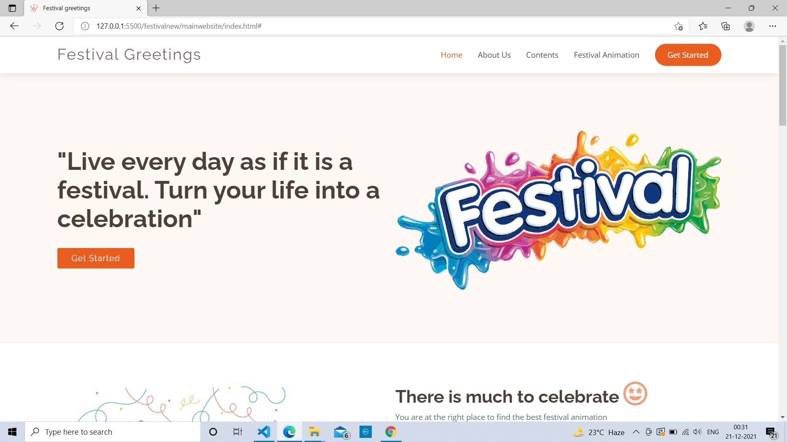
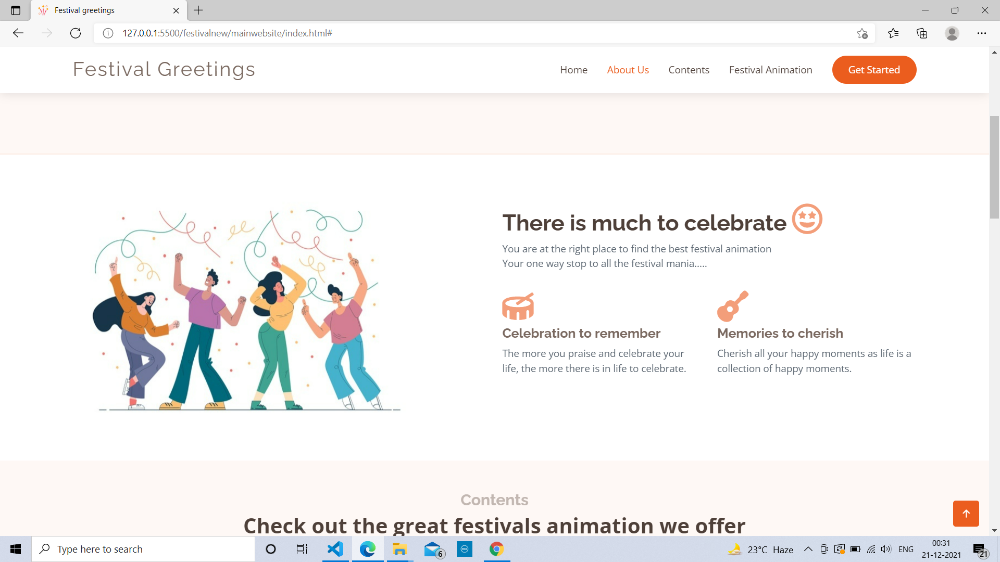

## Festival-Greeting-Website

<h2> Website Link : </h2> 
 

This project is a festival greeting website which i made using HTML, CSS and javascript. 
For hosting I have used Azure Static web app, Azure Static Web Apps is a service that automatically 
builds and deploys full stack web apps to Azure from a code repository So, I hosted using this service.
The website contains different types of 
festival greeting animation with short information about the festival.
The website is not a typical oldschool boring website, it gives user a wonderful experience with beautiful 
animations and sound effects.

 

## 📌 Following are some key features of Azure Static Web Apps that made me choose this service:

 

1. Web hosting for static content like HTML, CSS, JavaScript, and images.
2. Integrated API support provided by Azure Functions with the option to link an existing Azure Functions app using a standard account.
3. First-class GitHub and Azure DevOps integration where repository changes trigger builds and deployments.
4. Globally distributed static content, putting content closer to your users.
5. Free SSL certificates, which are automatically renewed.
6. Custom domains to provide branded customizations to your app.
7. Seamless security model with a reverse-proxy when calling APIs, which requires no CORS configuration.
8. Authentication provider integrations with Azure Active Directory, GitHub, and Twitter.
9. Customizable authorization role definition and assignments.
10. Back-end routing rules enabling full control over the content and routes you serve.
11. Generated staging versions powered by pull requests enabling preview versions of your site before publishing.

  
<h2>📌 Important links :</h2>
  
<h3><a href="https://witty-ocean-0a192f510.1.azurestaticapps.net/">Here is the azure website:</a></h3>
 
<h3><a href="https://youtu.be/qakM3yN-8Es">Here is the project demo:</a></h3>
  

## 📌 Main Page:
  

<h2>HEADER SECTION</h2>
 

  
<h2>ABOUT SECTION</h2>
 

  
<h2>CONTENT SECTION</h2>
 

  

  
<h2>ALL ANIMATION SECTION</h2>
 

  
<im
  

  

  

  

  
<h2>DIWALI PAGE ANIMATION SECTION</h2>
 

  

  
<h2>CHRISTMAS PAGE ANIMATION SECTION</h2>
 

  

  
<h2>REPUBLIC DAY PAGE ANIMATION SECTION</h2>
 

  

  

  

 

© 2021 Shruti Mishra 

